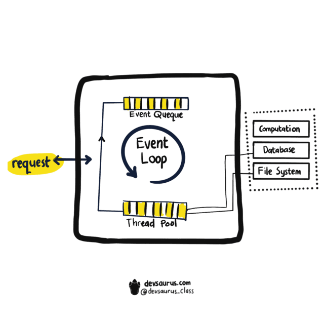

### Mohon jelaskan apa itu Node.js? Apa perbedannya dengan JavaScript?
```js
Node.js adalah sebuah software yang digunakan untuk pengembangan aplikasi berbasis web dan ditulis dalam sintaks bahasa pemrograman JavaScript yang bersifat open-source dan cross platform. Mempunyai library sendiri sehingga bisa berjalan tanpa menggunakan program web server seperti Apache atau Nginx.  Bertugas mengeksekusi kode JavaScript sebelum halaman website ditampilkan pada browser.

Sedangkan JavaScript adalah bahasa pemrograman yang digunakan bersamaan dengan HTML dan CSS yang berguna untuk membuat halaman website lebih interaktif.
```

### Mohon jelaskan arsitektur dari Node.js?

```js
Request, request masuk yang berasal dari user.
Node.js Server, server yang bertugas untuk menghandle request yang masuk dan memberikan response ke user.
Event Queue, menyimpan request sesuai urutan masuk untuk kemudian diproses oleh Event Loop satu per satu.
Event Loop / Main Thread, semua request yang masuk akan diproses oleh event loop untuk dieksekusi.
Worker Pool / Thread Pool, berisi thread untuk membantu kerja dari event loop.
```

### Ape perbedaan antara Built-in Module, External Module, dan Custom Module pada Node.js?
```js
Build in : package bawaan dari node js itu sendiri.
External : package yg bukan bawaan node js itu sendiri (mengambil dari luar).
Custom :  package module yang kita buat sesuai kebutuhan.
```

### Sebutkan salah satu contoh dari Built-in Module, External Module, dan Custom Module pada Node.js?
```js
Bulit-in Module : http, url, path, util, ft.
External Module : express, nodemoon dan lodash.
Custome Module :
    exports.myDateTime = function () {
    return Date();
    };
```